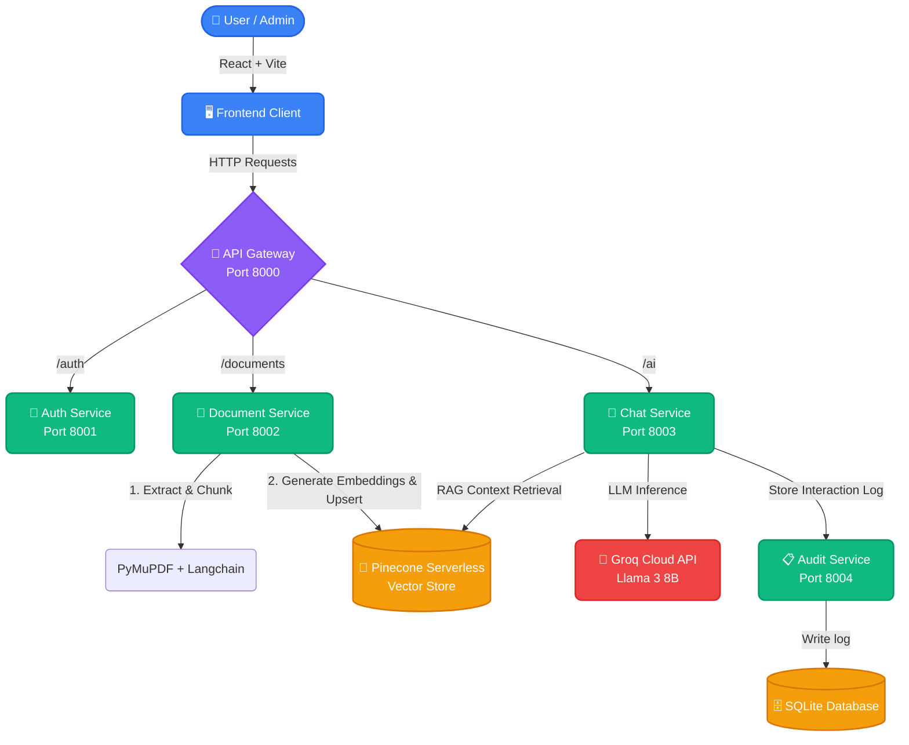
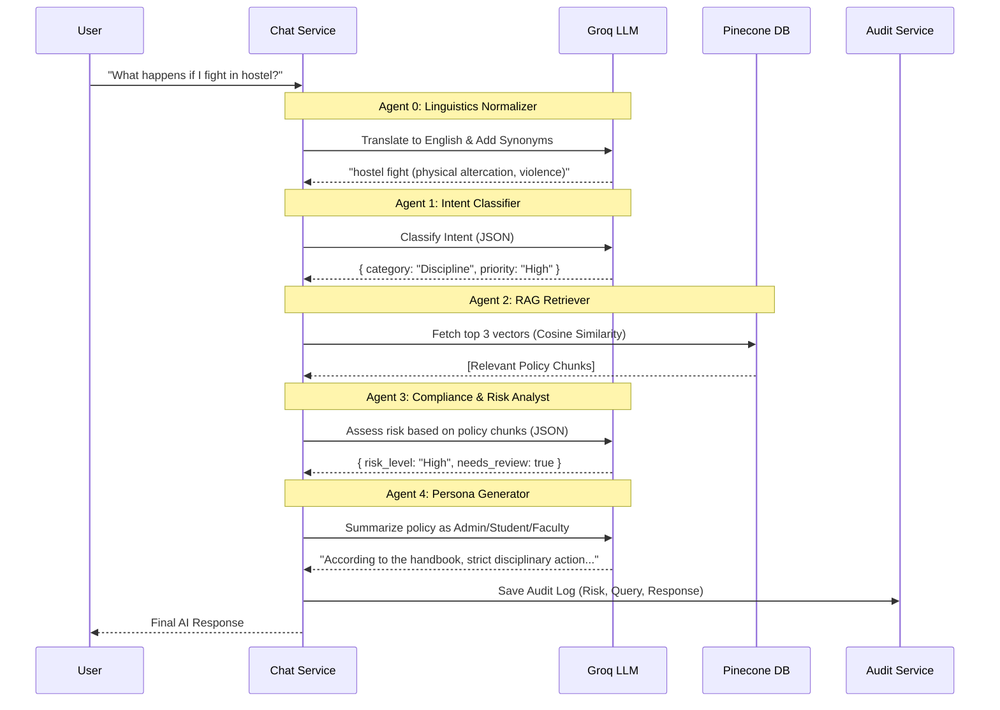

# UniGuard AI - System Architecture & API Documentation

This document provides a comprehensive overview of the UniGuard AI platform's microservice architecture, multi-agent data flows, and REST API endpoints.

## 1. High-Level Architecture

The system is built on a containerized **Microservices Architecture**. The frontend strictly communicates with a unified API Gateway, which intelligently proxies requests to specialized backend services.

---

## 2. Multi-Agent RAG Pipeline (Chat Flow)

When a user submits a query, the **Chat Service** orchestrates a sequence of 5 specialized AI agents to prevent hallucinations and strictly enforce university policy.

---

## 3. API Endpoints

All external requests from the frontend are routed through the **API Gateway (`http://localhost:8000`)**.

### 🔐 Auth Service (`/auth`)
| Endpoint | Method | Security | Description |
|----------|--------|----------|-------------|
| `/auth/login` | `POST` | Public | Authenticates an Admin using a secure PIN. Returns a JWT Bearer token. |

### 📄 Document Service (`/documents`)
| Endpoint | Method | Security | Description |
|----------|--------|----------|-------------|
| `/documents/upload` | `POST` | Admin JWT | Accepts a `.pdf` file. Extracts text, splits it into 1000-character chunks, generates embeddings, and saves them to Pinecone. |
| `/documents/list` | `GET` | Public | Queries Pinecone for unique document sources and returns a list of active policy files. |
| `/documents/{filename}` | `DELETE`| Admin JWT | Erases all vectors matching the specific document filename from the Pinecone index. |

### 🤖 Chat Service (`/ai`)
| Endpoint | Method | Security | Description |
|----------|--------|----------|-------------|
| `/ai/chat` | `POST` | Public | Triggers the Multi-Agent LLM pipeline. Accepts a JSON payload containing the user's `prompt`, `role` (Student/Faculty/Admin), and `history`. |

### 📋 Audit Service (`/audit` - Internal)
*Note: This service is typically only accessed internally by the Chat Service.*
| Endpoint | Method | Security | Description |
|----------|--------|----------|-------------|
| `/audit` | `POST` | Internal | Stores a completed chat interaction into the local SQLite database. |
| `/audit/logs` | `GET` | Admin JWT | Retrieves all stored system logs for administrative review. |
| `/audit/export`| `GET` | Admin JWT | Exports the entire database as a CSV for reporting. |
